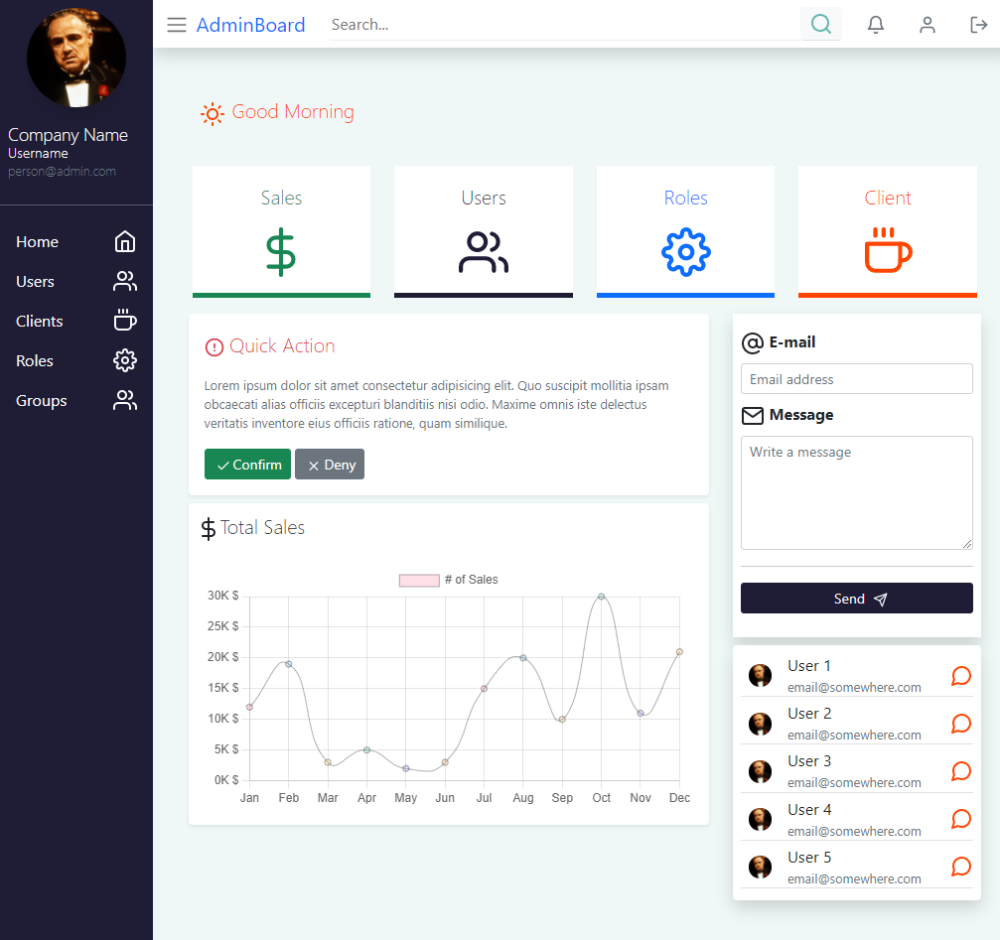
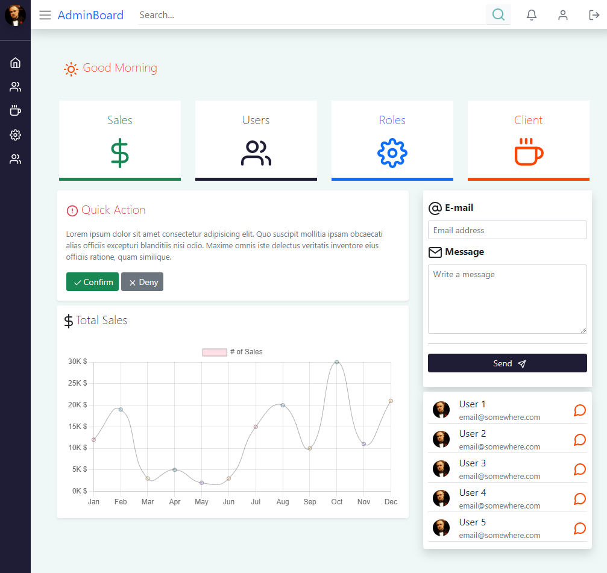
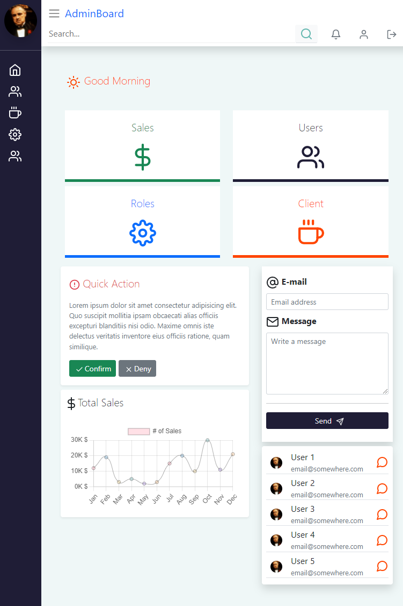
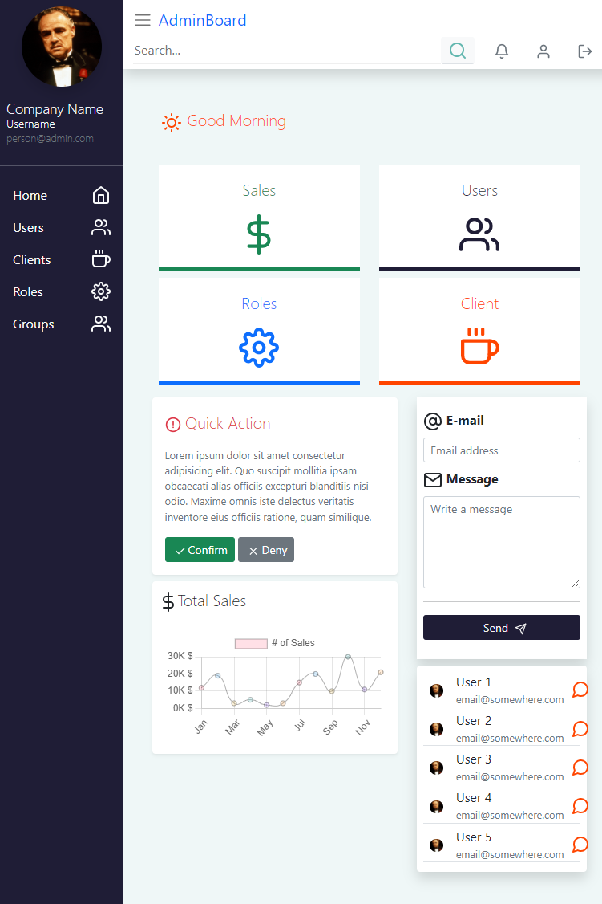
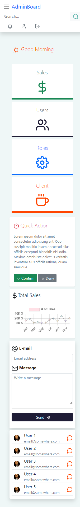

# Admin Panel Template
---------------------------
> Simple Admin panel template starter kit, with a minimum functionality

## Table of content 
 - [Download](#download)
 - [Screenshot](#screenshot)
    - [Laptop](#laptop-screen)
    - [Laptop menu sized](#laptop-screen-menu-sized)
    - [Tablet](#tablet-screen)
    - [Tablet menu sized](#tablet-screen-menu-sized)
    - [Mobile](#mobile-screen)
 - [Commands](#commands)
 - [Author](#author)

### Download 
[&uparrow; top](#table-of-content)
```bash 
  - git clone https://github.com/mkchemist/admin-panel-template.git
  - cd admin-panel-template
  - npm install 
```

### Screenshot
[&uparrow; top](#table-of-content)

- #### Laptop screen
    [&uparrow; top](#table-of-content)
   
- #### Laptop screen menu sized
    [&uparrow; top](#table-of-content)
   
- #### Tablet screen
    [&uparrow; top](#table-of-content)
   
- #### Tablet screen menu sized
    [&uparrow; top](#table-of-content)
   
- #### Mobile screen
    [&uparrow; top](#table-of-content)
   
  
### Commands
[&uparrow; top](#table-of-content)

----------------
to update or run this template in development mode, just open terminal and copy & paste command below:
```code
  npm run dev
```
to build your updated version , just run command below
```code
  npm run build
```

### Author
[&uparrow; top](#table-of-content)

---------------
Mohamed Kamal <m.k_chemist@yahoo.com>